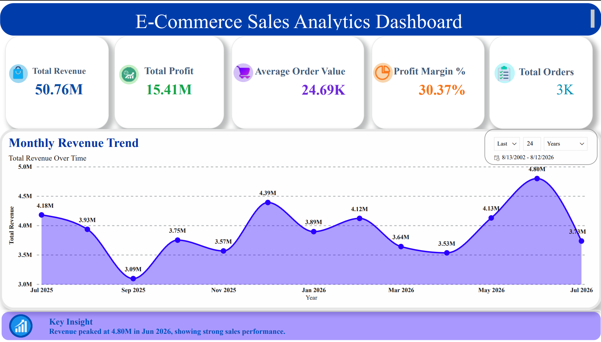

# E-Commerce Sales Analytics Dashboard

## Project Overview
This project analyzes e-commerce sales data to understand revenue,
profitability, customer behavior, product performance, and monthly
sales trends.

The complete workflow includes data cleaning in Excel, data storage
and analysis using MySQL, and interactive dashboard development
using Power BI.

## Tools Used
- Microsoft Excel
- MySQL
- SQL
- Power BI
- DAX

## Dataset
The project contains:
- 3,000 Orders
- 800 Customers
- 150 Products
- 6,000+ Order Detail Records

## Dashboard KPIs
- Total Revenue: 50.76M
- Total Profit: 15.41M
- Average Order Value: 24.69K
- Profit Margin: 30.37%
- Total Orders: ~3K

## Key Insights
- Revenue peaked at approximately 4.80M in June 2026.
- Monthly revenue was analyzed from July 2025 to July 2026.
- Product, category, customer, and geographical performance were
  analyzed using SQL and Power BI.

## Dashboard Preview

## SQL Analysis
SQL was used for:
- Revenue analysis
- Profit analysis
- Monthly sales trends
- Top-selling products
- Category performance
- Customer analysis
- State-wise sales analysis
- Order status analysis
- Payment method analysis

## DAX Measures
Key Power BI measures include:
- Total Revenue
- Total Profit
- Average Order Value
- Profit Margin %
- Total Orders

## Project Workflow

Excel Data Cleaning
↓
MySQL Database
↓
SQL Analysis
↓
Power BI Data Model
↓
DAX Measures
↓
Interactive Dashboard

## Files
- `data/` - Cleaned datasets
- `sql/` - SQL analysis queries
- `dax/` - DAX measures
- `dashboard/` - Dashboard PDF and screenshot
- `powerbi/` - Power BI project file

## Author
Aryan
